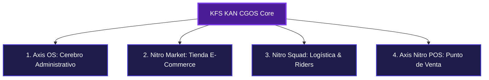

# 📘 DOCUMENTO MAESTRO — WHITE PAPER & MANUAL OPERATIVO INTEGRAL
## KFS OS (Kreatek Flow Systems) — "KAN CGOS" & Axis Nitro Core

**Código de Proyecto:** KFS-OS-WP-2026  
**Clasificación de Documento:** Confidencial / Corporativo & Operativo  
**Holding Propietario:** Kreatek Holding S.A.  
**Versión:** 8.0.0 (Lanzamiento y Producción)  
**Fecha de Emisión:** 29 de Julio de 2026  
**Código Maestro del Arquitecto Core:** `199521`  
**Dominio Principal:** `https://axisnitro.store`  
**Repositorio GitHub:** `https://github.com/nextgendynamicai-sudo/kfs-os.git`

---

## 📑 TABLA DE CONTENIDOS MAESTRA

1. [CAPÍTULO I: RESUMEN EJECUTIVO & VISIÓN CGOS](#1-resumen-ejecutivo--visión-cgos)
2. [CAPÍTULO II: ARQUITECTURA DETALLADA DE MÓDULOS DEL SISTEMA](#2-arquitectura-detallada-de-módulos-del-sistema)
3. [CAPÍTULO III: LA ECONOMÍA DE AXIS POINTS (TOKENOMICS & AOF)](#3-la-economía-de-axis-points-tokenomics--aof)
4. [CAPÍTULO IV: PROTOCOLOS DE SEGURIDAD OPERATIVA Y ANTIFRAUDE](#4-protocolos-de-seguridad-operativa-y-antifraude)
5. [CAPÍTULO V: DIRECTORIO COMPLETO DE RUTAS Y SUBDOMINIOS](#5-directorio-completo-de-rutas-y-subdominios)
6. [CAPÍTULO VI: NÚCLEOS DE NEGOCIO, SPLITS EN CALIENTE Y PROYECCIONES](#6-núcleos-de-negocio-splits-en-caliente-y-proyecciones)
7. [CAPÍTULO VII: GUÍA PASO A PASO POR ROL DEL ECOSISTEMA](#7-guía-paso-a-paso-por-rol-del-ecosistema)
8. [CAPÍTULO VIII: MANUAL COMERCIAL & ESTRATEGIA DE VENTAS ("MODO VENTAS")](#8-manual-comercial--estrategia-de-ventas-modo-ventas)
9. [CAPÍTULO IX: GUÍA DE CONFIGURACIÓN E INFRAESTRUCTURA TÉCNICA](#9-guía-de-configuración-e-infraestructura-técnica)

---

<a id="1-resumen-ejecutivo--visión-cgos"></a>
## 🏛️ CAPÍTULO I: RESUMEN EJECUTIVO & VISIÓN CGOS

### 1.1 La Revolución del CGOS (Commercial Growth Operating System)
**Kreatek Flow Systems (KFS)** introduce la categoría disruptiva **CGOS (Commercial Growth Operating System)**. A diferencia de los sistemas ERP rígidos y costosos del mercado tradicional, KAN CGOS funciona como un ecosistema comercial todo-en-uno diseñado específicamente para economías emergentes y redes comerciales dinámicas.

La plataforma unifica en un solo entorno **PWA (Progressive Web App)** de ultra-alto rendimiento:
- El punto de venta físico en caja registradora (**Axis Nitro POS**).
- La vitrina y comercio electrónico instantáneo (**Nitro Market**).
- La red logística y geolocalización de repartidores a domicilio (**Nitro Squad**).
- El centro de inteligencia administrativa y financiera (**Axis OS**).
- La economía universal de fidelización tokenizada (**Axis Points AP**).



---

### 1.2 El Problema de la Fragmentación y la Solución KFS

#### El Problema del Comercio Tradicional
1. **Pasarelas de Pago Ineficientes:** Comisiones del 3% al 8% en transferencias y retenedores bancarios que retrasan la liquidez inmediata del negocio.
2. **Puntos de Venta Rígidos:** Alquileres de equipos POS físicos costosos que no se comunican con los inventarios de las tiendas virtuales.
3. **Logística Desconectada:** Plataformas de delivery de terceros que cobran comisiones de hasta un 30% por pedido, destruyendo el margen de ganancia de los negocios locales.
4. **Ausencia de Fidelización Viable:** Imposibilidad técnica y financiera de implementar un programa de recompensas para atraer clientes recurrentes.
5. **Vulnerabilidad a Estafas:** Cajeros expuestos a comprobantes y capturas de pantalla de Pago Móvil falsas.

#### La Solución KFS CGOS
- **Arquitectura Offline-First:** Operatividad ininterrumpida en caja local con sincronización en tiempo real vía Supabase e IndexedDB.
- **Mercado de Comisión Cero:** Tiendas virtuales autogeneradas en milisegundos con comisiones mínimas.
- **Logística Geogestionada Directa:** Asignación inteligente de motorizados propios sin peajes intermediarios.
- **Fidelización Tokenizada Universales:** Moneda interna **Axis Points (AP)** compartida por toda la red comercial.

---

<a id="2-arquitectura-detallada-de-módulos-del-sistema"></a>
## 📱 CAPÍTULO II: ARQUITECTURA DETALLADA DE MÓDULOS DEL SISTEMA

### 2.1 Axis OS (El Cerebro Administrativo)
- **Propósito:** Centro de control telemétrico y financiero para el Kreatek Operator (Dueño del Comercio).
- **Prestaciones Destacadas:**
  - Control de inventarios multimoneda (USD / Bolívares) con compresión automática de imágenes en Base64.
  - Gestión de tasas de cambio diarias del Banco Central de Venezuela (BCV) con conversión dinámica en caliente.
  - Conciliación de caja dual (Efectivo, Pago Móvil, Binance Pay, Axis Points).
  - Configuración de roles de cajeros y terminales móviles autorizados.

---

### 2.2 Nitro Market (La Vitrina Digital)
- **Propósito:** Tienda virtual instantánea autogenerada bajo la ruta `/nitro/[slug]`.
- **Prestaciones Destacadas:**
  - Sincronización automática del catálogo en tiempo real.
  - Cálculo de tarifa de despacho (delivery) en base al radio kilométrico y distancia GPS (latitud y longitud).
  - Checkout optimizado para pedidos por WhatsApp o Pago Móvil directo.

---

### 2.3 Nitro Squad (La Red Logística Geogestionada)
- **Propósito:** Gestión y seguimiento georreferenciado de motorizados y repartidores (Riders).
- **Prestaciones Destacadas:**
  - Registro y validación KYC de Riders locales.
  - Mapas vectoriales interactivos en tiempo real con la API de Leaflet y CartoDB Voyager.
  - Cálculo dinámico de ETA (Tiempo Estimado de Arribo) y tracking del paquete.

---

### 2.4 Axis Nitro POS (El Punto de Venta Inteligente)
- **Propósito:** Facturación táctil ultrarrápida en caja registradora.
- **Presets por Industria (Feature Flags):**
  - **Preset Retail / Quick Store:** Habilita el escáner de código de barras. Al escanear, consulta el Catálogo Nacional y hace fallback a Open Food Facts para autocompletar foto y descripción del producto en milisegundos.
  - **Preset Restaurantes / Escandallos:** Control de mesas físicas y recetas de ingredientes pesados.
  - **Preset Balanzas IoT:** Conexión websocket directa con balanzas digitales de peso bruto/neto.
  - **Preset Hoteles / Hospedaje:** Control de habitaciones y consumos acumulados.

---

<a id="3-la-economía-de-axis-points-tokenomics--aof"></a>
## 🪙 CAPÍTULO III: LA ECONOMÍA DE AXIS POINTS (TOKENOMICS & AOF)

El ecosistema financiero de KFS se apoya en un programa de incentivos universales tokenizados, diseñado para retener al cliente dentro de la red local:

$$\mathbf{1,000\ Axis\ Points\ (AP) = \$1.00\ USD}$$

### 3.1 Reglas de Emisión (Minting)
1. **Cashback de Compra:** Los clientes acumulan el **1.0%** del total de sus compras físicas u online en saldo equivalente de **Axis Points**.
2. **Loyalty Comercio:** Si el local tiene activo el programa de lealtad, se genera adicionalmente **0.5 AP por cada $1.00 USD** de consumo.
3. **Bono Viral de Referidos (Referral Rewards):**
   - Al registrarse con un código amigo, el nuevo usuario recibe **+100 AP ($0.10 USD)**.
   - Cuando el referido realiza su primera recargas de al menos **$5.00 USD**, el recomendador recibe un bono de **+500 AP ($0.50 USD)**.

---

### 3.2 Reglas de Degradación de Saldo (Mecanismo Anti-Inflacionario AOF)
Para evitar que los puntos se acumulen indefinitivamente y pierdan velocidad de circulación, se aplica la tasa de penalización por inactividad **AOF (Asset Outflow Fee)**:
- Si una cuenta permanece inactiva por más de **15 días**, su saldo sufre una degradación progresiva del **0.5% cada 5 días**.
- El sistema emite alertas móviles advirtiendo de la degradación inminente para forzar al cliente a consumir sus puntos en los comercios de la red.

---

### 3.3 El Rango FlowMaster (Inmunidad Financiera)
Los clientes más leales pueden lograr **inmunidad vitalicia frente al AOF** al alcanzar el rango **FlowMaster**. Requisitos:
1. Haber completado un mínimo de **10 transacciones reales** en la red.
2. Haber comprado en al menos **4 comercios diferentes**.
3. Haber movilizado un volumen transaccional de al menos **50,000 Axis Points ($50.00 USD)** acumulados.

---

<a id="4-protocolos-de-seguridad-operativa-y-antifraude"></a>
## 🛡️ CAPÍTULO IV: PROTOCOLOS DE SEGURIDAD OPERATIVA Y ANTIFRAUDE

### 4.1 Conciliador Inteligente SMS (SMS Conciliator)
- **Mecanismo:** Intercepta y procesa notificaciones SMS bancarias recibidas en el dispositivo del comercio.
- **Algoritmo de Parseo:** Utiliza expresiones regulares para extraer Número de Referencia, Monto en Bolívares y Teléfono Emisor.
- **Validación Automática:** Compara la referencia y monto contra la orden en cola. Si coinciden con la tasa BCV del momento, la orden pasa a estado "Pagado", dispara el sonido `Premium Cash Chime` y emite el ticket de despacho sin intervención humana.

---

### 4.2 Protocolo Ghost Trap (Bloqueo Antifraude de Caja)
- **Mecanismo:** Detecta intentos deshonestos de anulación de tickets o borrado de productos una vez ingresados a la venta.
- **Acción:** El terminal POS **se bloquea automáticamente** e interrumpe la pantalla de cobro, registrando un log forense (`ghostLogs`).
- **Desbloqueo Requerido:** Clave del Supervisor local, Clave Maestra del Dueño del Negocio o Clave del Arquitecto Core (`199521`).

---

### 4.3 Sincro-Shield Fiscal Proxy
Conexión directa por agente local a impresoras fiscales homologadas por el SENIAT mediante comandos a puertos serie (RS232/USB), reduciendo a cero dólares el costo de licenciamiento fiscal.

---

<a id="5-directorio-completo-de-rutas-y-subdominios"></a>
## 🌐 CAPÍTULO V: DIRECTORIO COMPLETO DE RUTAS Y SUBDOMINIOS

| Subdominio Oficial en Vercel | Ruta Directa por Carpeta | Perfil / Rol Asignado | Función Operativa del Módulo |
| :--- | :--- | :--- | :--- |
| **`axisnitro.store`** | `https://axisnitro.store/` | **Público General** | **Portal Matriz & Landing Comercial:** Presentación del negocio, simulador de ganancias y formulario B2B. |
| **`rewards.axisnitro.store`** | `https://axisnitro.store/rewards` | **Cliente / Consumidor** | **App PWA de Recompensas:** Billetera de Axis Points (AP), tareas físicas y catálogo de vales. |
| **`arquitecto.axisnitro.store`** | `https://axisnitro.store/arquitecto` *(o `/core`)* | **El Arquitecto (`199521`)** | **Centro de Mando Core:** Vista de Dios, telemétrica, cotización BCV, gestor de recompensas e impresión QR. |
| **`comercio.axisnitro.store`** | `https://axisnitro.store/comercio` *(o `/client`)* | **Comercios / Dueños** | **Dashboard del Negocio:** Carga de productos en USD, tienda Nitro, CRM y Pago Móvil. |
| **`promotora.axisnitro.store`** | `https://axisnitro.store/promotora` | **Promotoras Digitales** | **Consola de Referidos:** Reclutamiento de comercios y cobro de comisiones pasivas en USD. |
| **`vendedor.axisnitro.store`** | `https://axisnitro.store/vendedor` | **Vendedores de Caja** | **Terminal Táctico POS:** Lector de código de barras, venta de mostrador y Ghost Trap. |
| **`rider.axisnitro.store`** | `https://axisnitro.store/rider` | **Riders de Delivery** | **Panel Logístico:** Recepción de pedidos a domicilio, confirmación de retiro y navegación GPS. |
| **`pos.axisnitro.store`** | `https://axisnitro.store/pos` | **Cajeros / Mostrador** | **Punto de Venta POS Simplificado:** Cobro directo en pantalla táctil. |
| **`download.axisnitro.store`** | `https://axisnitro.store/download-apk` | **Público General** | **Centro de Descargas PWA / APK:** Instalador oficial para Android e iOS. |

---

<a id="6-núcleos-de-negocio-splits-en-caliente-y-proyecciones"></a>
## 📊 CAPÍTULO VI: NÚCLEOS DE NEGOCIO, SPLITS EN CALIENTE Y PROYECCIONES

El motor financiero distribuye los ingresos de forma inmediata mediante un modelo de **Splits en Caliente**:

| Concepto de Transacción | Costo Total | Comisión Promotora (Captadora) | Destino Core KFS | Objetivo del Split |
| :--- | :--- | :--- | :--- | :--- |
| **Setup de Comercio** | $75.00 USD *(Único)* | **$37.50 USD (50%)** *(Retiro Inmediato)* | $37.50 USD (50%) | Aprovisionamiento de base de datos Supabase y subdominio. |
| **Mantenimiento Nube** | $6.00 USD *(Mensual)* | **$3.00 USD (50%)** *(Residual)* | $3.00 USD (50%) | Servidores Vercel, logs de auditoría y webhooks SMS. |
| **Regalías de Caja (POS)** | 3% / 5% / 8% por venta | **20%** de la comisión recaudada | 80% KFS Core | Sustento de software. 20% del Core va directo a Ads locales. |
| **Desbloqueo KYC RRHH** | $10.00 USD *(Talento)* | **$2.00 USD (20%)** | $8.00 USD (80%) | Verificación de referencias de candidatos. |
| **Venta Axis Nitro Hub** | $20.00 USD *(Único)* | **$10.00 USD (50%)** | $10.00 USD (50%) | Habilitación de tienda E-Commerce independiente. |

---

### 6.1 Proyección Financiera para una Promotora Senior
Considerando una Promotora activa con una cartera madura de **22 comercios afiliados** en 12 meses:
- **15 Comercios Pequeños** (Venta promedio $5,000/mes a 3% fee) ➔ $450.00 USD/mes.
- **5 Comercios Medianos** (Venta promedio $25,000/mes a 5% fee) ➔ $1,265.00 USD/mes.
- **2 Cadenas Grandes** (Venta promedio $120,000/mes a 8% fee) ➔ $3,840.00 USD/mes.
- **SaaS Residual:** 22 × $3.00 = $66.00 USD/mes.
- **TOTAL INGRESOS RESIDUALES:** **$5,621.00 USD / mes de ganancia pasiva recurrente.**

---

<a id="7-guía-paso-a-paso-por-rol-del-ecosistema"></a>
## 🛠️ CAPÍTULO VII: GUÍA PASO A PASO POR ROL DEL ECOSISTEMA

### 7.1 El Arquitecto Core (Código Maestro `199521`)
- **Acceso:** `https://axisnitro.store/arquitecto` ➔ Clave: **`199521`**.
- **Operaciones:**
  1. **Cotización BCV:** Ajustar el valor del Dólar/Euro en la barra superior.
  2. **Configurar Tareas de Recompensas (`⚡ Recompensas Nitro`):** Definir el nombre de la acción física, los Axis Points de recompensa (ej: `250 AP`) y la clave secreta QR o coordenadas GPS.
  3. **Imprimir Códigos QR:** Presionar **`🖨️ Ver QR`** para generar el gráfico SVG vectorizado e imprimir la ficha del comercio.
  4. **Aprobar Entregas de Usuarios:** En `📥 Entregas Recibidas`, revisar las fotos o datos y presionar **`🟢 Aprobar y Desembolsar +AP`** para acreditar los puntos atómicamente a la cuenta del usuario.

---

### 7.2 El Consumidor / Cliente (App PWA de Recompensas)
- **Acceso:** `https://axisnitro.store/rewards`.
- **Operaciones:**
  1. **Instalar PWA:** Presionar *"Añadir a la Pantalla de Inicio"*.
  2. **Consultar Saldo:** Ver balance en vivo de **Axis Points (AP)**.
  3. **Cumplir Tareas (`⚡ Acciones`):** Escanear el QR en caja, verificar ubicación GPS o subir foto de la factura.
  4. **Canjear Vales (`🎁 Canjes`):** Convertir puntos en cupones de descuento.

---

### 7.3 El Comercio / Dueño de Negocio (`/comercio`)
- **Acceso:** `https://axisnitro.store/comercio`.
- **Operaciones:**
  1. **Inventario:** Cargar productos con precio en USD y stock.
  2. **Cobro:** Vincular cuenta de Pago Móvil y Binance Pay.

---

### 7.4 La Promotora Digital (`/promotora`)
- **Acceso:** `https://axisnitro.store/promotora`.
- **Operaciones:**
  1. **Reclutar:** Compartir su enlace personal con dueños de tiendas.
  2. **Cobrar Comisiones:** Solicitar retiros a su cuenta bancaria.

---

### 7.5 El Vendedor de Caja (`/vendedor`)
- **Acceso:** `https://axisnitro.store/vendedor`.
- **Operaciones:**
  1. **Facturación:** Escanear códigos de barras o seleccionar ítems.
  2. **Procesar Pago:** Emitir recibo digital de cobro.

---

<a id="8-manual-comercial--estrategia-de-ventas-modo-ventas"></a>
## 💵 CAPÍTULO VIII: MANUAL COMERCIAL & ESTRATEGIA DE VENTAS ("MODO VENTAS")

### 8.1 Ofertas Comerciales Activas
- **Plan Estándar Axis Nitro B2B:** **$20.00 USD / mes** + **3.0% por transacción**.
- **Oferta Comerciales Pioneros:** **$10.00 USD / mes** *(50% de descuento durante los primeros 3 meses)*.
- **Prueba Demo Gratuita:** **7 Días sin costo**.

---

<a id="9-guía-de-configuración-e-infraestructura-técnica"></a>
## ⚙️ CAPÍTULO IX: GUÍA DE CONFIGURACIÓN E INFRAESTRUCTURA TÉCNICA

### 9.1 Esquema de Base de Datos PostgreSQL Supabase
La migración oficial `supabase/migrations/20260730000000_create_axis_nitro_rewards.sql` define la estructura SQL:

```sql
-- 1. Tabla de Estados Globales del CGOS (Offline Sync)
CREATE TABLE kfs_store_states (
  id TEXT PRIMARY KEY,
  db_state JSONB NOT NULL,
  updated_at TIMESTAMP WITH TIME ZONE DEFAULT NOW() NOT NULL
);

-- 2. Tabla para Nodos de E-Commerce (Axis Nitro Hubs)
CREATE TABLE axis_nitro_hubs (
    id UUID DEFAULT gen_random_uuid() PRIMARY KEY,
    owner_id UUID REFERENCES auth.users(id),
    store_name TEXT NOT NULL,
    slug TEXT UNIQUE NOT NULL,
    logo_url TEXT,
    is_active BOOLEAN DEFAULT true,
    created_at TIMESTAMP WITH TIME ZONE DEFAULT NOW()
);

-- 3. Tabla para Tareas de Recompensas
CREATE TABLE kfs_reward_tasks (
    id UUID DEFAULT gen_random_uuid() PRIMARY KEY,
    title TEXT NOT NULL,
    description TEXT NOT NULL,
    points_reward INT NOT NULL DEFAULT 100,
    category TEXT NOT NULL DEFAULT 'SCAN_QR',
    verification_type TEXT NOT NULL DEFAULT 'AUTOMATIC_QR',
    status TEXT NOT NULL DEFAULT 'ACTIVE',
    target_audience TEXT NOT NULL DEFAULT 'ALL',
    qr_code_secret TEXT,
    created_at TIMESTAMP WITH TIME ZONE DEFAULT NOW()
);
```

---

> [!NOTE]
> Este documento representa el Manual Maestro e Informe White Paper Oficial de KFS OS & Axis Nitro Core. Todo el código fuente y las rutas de producción han sido compilados y verificados exitosamente para su funcionamiento comercial inmediato.
