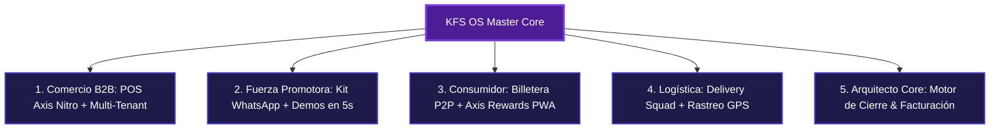

# 📘 LIBRO MAESTRO — SUPER WHITE PAPER & MANUAL OPERATIVO DEFINITIVO
## KFS OS (Kreatek Flow Systems) — "KAN CGOS" & Axis Nitro Core Ecosystem

**Código de Proyecto:** KFS-OS-WP-2026-FINAL-COMMERCIAL  
**Clasificación de Documento:** Corporativo, Operativo & Dossier para Inversores  
**Holding Propietario:** Kreatek Holding S.A.  
**Versión del Sistema:** 8.0.0 (Edición Producción Global - 100% Vendible)  
**Código Maestro del Arquitecto Core:** `199521`  
**Dominio Principal en Vivo:** `https://axisnitro.store`  
**Repositorio Oficial GitHub:** `https://github.com/nextgendynamicai-sudo/kfs-os.git`

---

## 📑 TABLA DE CONTENIDOS GENERAL

1. [CAPÍTULO I: RESUMEN EJECUTIVO & DOSSIER PARA INVERSORES](#capitulo-1)
2. [CAPÍTULO II: ARQUITECTURA TECNOLÓGICA & OFFLINE-FIRST RESILIENCE](#capitulo-2)
3. [CAPÍTULO III: MÓDULO DEL ARQUITECTO CORE & MOTOR DE CIERRE EN VIVO](#capitulo-3)
4. [CAPÍTULO IV: MÓDULO COMERCIO B2B (AXIS NITRO POS & MULTI-TENANT)](#capitulo-4)
5. [CAPÍTULO V: MÓDULO DE PROMOTORAS & FUERZA DE VENTAS](#capitulo-5)
6. [CAPÍTULO VI: MÓDULO CLIENTES, BILLETERA & AXIS NITRO REWARDS](#capitulo-6)
7. [CAPÍTULO VII: MÓDULO LOGÍSTICA & RIDERS (NITRO SQUAD)](#capitulo-7)
8. [CAPÍTULO VIII: ECONOMÍA DE PUNTOS AXIS (TOKENOMICS & FIDELIZACIÓN)](#capitulo-8)
9. [CAPÍTULO IX: SEGURIDAD OPERATIVA, BLOQUEO DÍA 5 & PERSISTENCIA INDESTRUCTIBLE](#capitulo-9)
10. [CAPÍTULO X: MANUAL DE ENTRENAMIENTO PARA TRABAJADORES Y PROMOTORAS](#capitulo-10)

---

## 🏛️ CAPÍTULO I: RESUMEN EJECUTIVO & DOSSIER PARA INVERSORES

### 1.1 La Categoría CGOS (Commercial Growth Operating System)
**Kreatek Flow Systems (KFS)** inventa y lidera la categoría **CGOS (Commercial Growth Operating System)**. A diferencia de los ERPs tradicionales rígidos o las apps de delivery extractivas que cobran entre 25% y 30% a los comercios, KFS OS ofrece una infraestructura comercial descentralizada, ágil y de ultra-bajo costo.

### 1.2 Métricas Clave y Modelo Financiero para Inversores
- **Suscripción B2B Recurrente (MRR):** $100 USD / mes por comercio activo (o porcentaje de facturación del 1% al 3%).
- **Comisiones de Transacción:** Split automático en caliente sobre transferencias, recargas y validaciones de puntos.
- **Activación de Perfiles Profesionales:** $1.00 USD por emisión de CV Digital verificado en la bolsa de trabajo.
- **Retención (Churn Rate Proyectado):** < 3% debido a la integración integral de caja, inventario, vitrina virtual y programa de fidelización de clientes en el mismo software.
- **CAC Ultrabajo:** El sistema convierte a los propios comerciantes y clientes en embajadores a través de enlaces de referidos y kits automatizados para promotoras en WhatsApp.

---

## ⚡ CAPÍTULO II: ARQUITECTURA TECNOLÓGICA & OFFLINE-FIRST RESILIENCE

### 2.1 Stack Tecnológico de Nueva Generación
- **Frontend / Core Framework:** Next.js 16.2.6 con compilador Turbopack y React 19.
- **Base de Datos & Cloud Sync:** Supabase Relacional (PostgreSQL en la nube) combinado con IndexedDB de alta velocidad en el cliente navegador.
- **Experiencia Móvil Nativa (PWA):** Viewport optimizado con `user-scalable=0` que previene el zoom involuntario en smartphones iOS y Android, ofreciendo un tacto de app nativa sin requerir descarga obligatoria de App Store / Play Store.
- **Distribución de Escritorio:** Empaquetador Electron con NSIS installer (`.exe`) para puntos de venta fijos en cajas registradoras.

### 2.2 Protocolo de Resiliencia Offline (Zero-Downtime Guarantee)
En mercados emergentes o zonas con intermitencia eléctrica y de internet:
1. El POS procesa ventas localmente en milisegundos guardando el estado en IndexedDB.
2. La base de datos calcula vuelto, actualiza inventario y genera tickets sin esperar respuesta del servidor.
3. Al recuperar conectividad, el motor `forceDirectCloudSync` sincroniza transacciones y balances en segundo plano con Supabase.

---

## 🎯 CAPÍTULO III: MÓDULO DEL ARQUITECTO CORE & MOTOR DE CIERRE EN VIVO

### 3.1 El Motor de Demostración en Vivo (`LiveDemoPitchManager`)
Diseñado para que el Arquitecto Core o Director de Expansión pueda sentarse frente a un dueño de negocio y configurar su tienda virtual en 60 segundos:
- **Configuración en Caliente:** Carga inmediata de plantillas por rubro (Bodegón, Comida Rápida, Farmacia, Ropa, Ferretería).
- **Añadir Artículos en Tiempo Real:** Permite agregar un producto real del prospecto mientras este observa la pantalla.
- **Color de Marca Personalizado:** Selector de paleta estética instantánea.

### 3.2 Activación de Negocio en 1 Clic (Si el cliente compra)
Cuando el prospecto dice que sí:
1. Se abre el configurador de condiciones comerciales:
   - **Cuota Fija Mensual:** $100 USD/mes con ciclo de cobro del 1 al 5.
   - **Porcentaje de Facturación:** 1.0% a 3.0% de sus ventas.
   - **Modelo Híbrido:** Cuota reducida ($50 USD/mes) + 1% de facturación.
   - **Plan Promocional:** $0 para pruebas piloto estratégicas.
2. **Generación de Credenciales Provisorias:** Contraseña temporal autogenerada con el flag `requirePasswordChangeOnFirstLogin: true`.
3. **Ficha de Entrega Digital:** Un solo botón genera el mensaje de WhatsApp con su enlace, usuario y contraseña provisoria.
4. **Primer Inicio de Sesión del Cliente:** Al ingresar por primera vez, el sistema obliga al dueño a crear su clave privada, asegurando su privacidad total.

### 3.3 Descarte Seguro de Demostración (Si no se concreta la venta)
Un botón de descarte elimina todos los registros temporales y productos de prueba sin tocar jamás las cuentas o transacciones de negocios reales.

---

## 🏪 CAPÍTULO IV: MÓDULO COMERCIO B2B (AXIS NITRO POS & MULTI-TENANT)

### 4.1 Punto de Venta Inteligente (Axis Nitro POS)
- **Facturación Multimoneda:** Conversión automática en tiempo real con la tasa oficial del Banco Central de Venezuela (BCV) en USD y Bolívares.
- **Calculadora de Vuelto Inteligente (`SmartChangeCalculator`):** Desglosa combinaciones exactas de billetes y pago móvil para solucionar la escasez de efectivo.
- **Alertas de Stock Bajo (`LowStockAlertsWidget`):** Indicadores visuales en tiempo real que previenen desabastecimiento.
- **Vales de Crédito a Clientes:** Emisión y abono parcial de cuentas fiadas o créditos de confianza.
- **Arqueo y Reporte Z:** Cierre de caja por turno y vendedor con exportación de comprobantes.

### 4.2 Hub Multi-Tenant
Permite a empresarios administrar múltiples sucursales o empresas desde un único panel centralizado, segregando inventarios, ventas y personal con aislamiento total.

---

## 💼 CAPÍTULO V: MÓDULO DE PROMOTORAS & FUERZA DE VENTAS

### 5.1 Armas de Cierre Comercial para Agentes
- **Kit de WhatsApp de 1 Clic (`PromoterWhatsAppPitchKit`):** Plantillas de prospección directa preparadas para enviar a comercios fríos o tibios.
- **Calculadora de Ahorro para Comercios (`MerchantSavingsPitchCalculator`):** Demuestra al comerciante en números reales cuánto dinero pierde con alquileres de POS tradicionales y pasarelas bancarias frente al ahorro masivo con KFS OS.
- **Generador de Demos en 5 Segundos (`InstantDemoGenerator`):** Crea enlaces `/nitro/[slug]` para compartir por WhatsApp al instante.
- **Onboarding Express KYC (`ExpressMerchantOnboardingModal`):** Registro de nuevos comercios en 3 pasos sencillos.

---

## 💳 CAPÍTULO VI: MÓDULO CLIENTES, BILLETERA & AXIS NITRO REWARDS

### 6.1 Billetera Universal Multimoneda
- Saldos combinados en USD, Bolívares y Puntos Axis.
- **Transferencias P2P Instantáneas:** Envío directo entre números de teléfono sin comisiones bancarias.
- **Recargas de Saldo Express:** Validación con captura de pago móvil o Binance Pay.

### 6.2 App de Recompensas PWA (`AxisNitroRewardsApp`)
- Gamificación interactiva: Tareas de fidelización con validación por código QR, coordenadas GPS y fotos de facturas.
- Canje de vales de compra y productos en comercios de la red.
- Navegación fluida con botón de retorno integrado bajo arquitectura SPA (`useRouter`).

### 6.3 Bolsa de Trabajo & CV Digital
- Creación de currículum vitae estructurado y descargable en PDF con código QR de verificación para candidatos de empleo.

---

## 🛵 CAPÍTULO VII: MÓDULO LOGÍSTICA & RIDERS (NITRO SQUAD)

### 7.1 Gestión de Flotas de Reparto
- **Despacho Directo:** Asignación de pedidos en línea desde el e-commerce del comercio al motorizado.
- **Rastreo en Vivo con Leaflet Maps:** Coordenadas GPS del repartidor visibles por el cliente y el comercio.
- **Check-in / Check-out:** Control de turnos y estado de disponibilidad del motorizado.
- **Sistema de Calificación:** Métricas de puntualidad y estrellas por servicio entregado.

---

## 🪙 CAPÍTULO VIII: ECONOMÍA DE PUNTOS AXIS (TOKENOMICS & FIDELIZACIÓN)

1. **Paridad y Valor:** 100 Axis Points (AP) equivalen a $0.10 USD (1,000 AP = $1.00 USD).
2. **Ciclo de Circulación:**
   - Los comercios emiten puntos a sus clientes en cada compra para premiar la recurrencia.
   - Los clientes acumulan puntos y los redimen en cualquier negocio afiliado a la red KFS OS.
   - KFS OS actúa como cámara de compensación transparente que liquida y arbitra los puntos entre comercios.

---

## 🛡️ CAPÍTULO IX: SEGURIDAD OPERATIVA, BLOQUEO DÍA 5 & PERSISTENCIA INDESTRUCTIBLE

### 9.1 Regla Infranqueable de Persistencia Indestructible
- Las rutinas de fusión de datos (`upgradeToNewBaseline` y `mergeIncomingDb` en `KFSContext.tsx`) **NUNCA** eliminan ni sobrescriben cuentas de usuarios, compras o transacciones reales tras nuevos despliegues de software.

### 9.2 Control de Suspensión por Cobranza (Día 5)
- Si un comercio en modalidad mensual fija no concilia su cuota entre los días 1 y 5 del mes, el componente `AppEnforcer` activa una pantalla de suspensión operativa.
- **Código de Desbloqueo Maestro:** El Arquitecto Core o Supervisor puede ingresar el PIN maestro `199521` para reactivar temporalmente el sistema en caso de auditoría o convenio directo.

---

## 📖 CAPÍTULO X: MANUAL DE ENTRENAMIENTO PARA TRABAJADORES Y PROMOTORAS

### 10.1 Guía Rápida de Venta para Promotoras
1. **Paso 1 (Apertura):** Saluda al comerciante y pregúntale: *"¿Cuánto estás pagando al mes por tu punto de venta y comisiones de delivery?"*.
2. **Paso 2 (Demostración Impacto):** Abre el Generador de Demo en tu teléfono, pon el nombre de su negocio y en 30 segundos muéstrale su tienda virtual con sus productos.
3. **Paso 3 (Ahorro):** Usa la Calculadora de Ahorro y muéstrale que ahorrará cientos de dólares al año.
4. **Paso 4 (Cierre):** Dile: *"Te lo dejo activado hoy mismo con 7 días de garantía. Solo ingresas con tu teléfono y defines tu clave personal."*.
5. **Paso 5 (Entrega):** Presiona "Activar Negocio", selecciona su cuota y envíale su ticket por WhatsApp.

---
*KFS OS / Axis Nitro Core — Documento Oficial de Producción 2026. Todos los derechos reservados Kreatek Holding S.A.*
